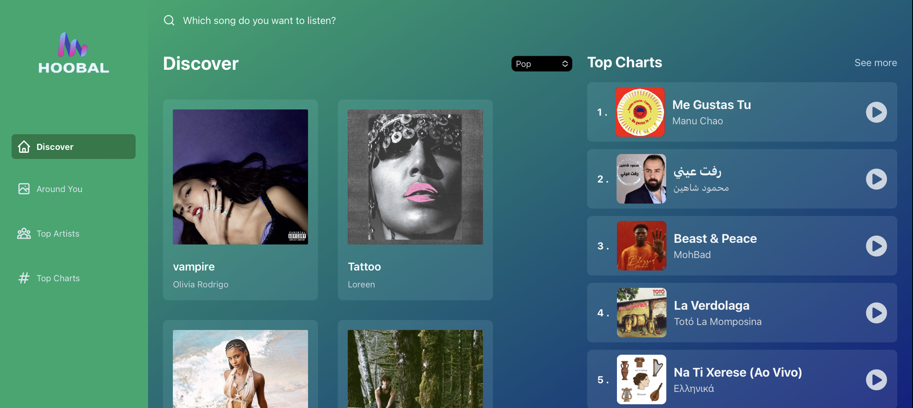

<a name="readme-top"></a>
<div align="center">

  
  

  <h1>Hoobal Music Play</h1>
  
  <p>
    Hoobal is a responsive music play website that allows you to discover music by genre, search for songs by title or artist, discover songs around you, explore top charts, top plays, and listen to your favorite tracks. It's built with ReactJS, Tailwind CSS, Redux Toolkit, and integrates with the RapidAPI Shazam API.
  </p>
  
## Features

- **Discover by Genre**: Explore music categorized by genre to find your favorite tunes.

- **Search Songs**: Easily search for songs by title or artist using the search feature.

- **Discover Around You**: Discover music based on your location or preferences.

- **Top Charts**: Stay up-to-date with the latest top charting songs.

- **Top Artists**: See what artists are trending and getting their songs most plays.

- **Top Plays**: See what songs are trending and getting the most plays.

- **Listen to Songs**: Enjoy a seamless music listening experience on Hoobal.

 <h4>
    <a href="https://hoobal.netlify.app/">View Demo</a>
  <span> · </span>
    <a href="https://github.com/awelrisak/hoobal">Documentation</a>
  <span> · </span>
    <a href="https://github.com/awelrisak/hoobal/issues/">Report Bug</a>
  <span> · </span>
    <a href="https://github.com/awelrisak/hoobal/issues/">Request Feature</a>
  </h4>
</div>

<br />

<!-- Table of Contents -->
<details>

<summary>

# :notebook_with_decorative_cover: Table of Contents

</summary>

- [About the Project](#star2-about-the-project)
  * [Folder Structure](#bangbang-folder-structure)
  * [Tech Stack](#space_invader-tech-stack)

</details>  

<!-- About the Project -->
## :star2: About the Project

<div align="center">
  
</div>

<br />

<!-- Folder Structure -->
### :bangbang: Folder Structure

Here is the folder structure of Hoobal Music Play.
```bash
Hoobal/
|-client
  |- public/
  |- src/
    |-- assets/
    |-- components/
    |-- constants/
    |-- layouts/
    |--redux/
    |-- routes/
    |--app.jsx
    |-- router.js
    |-- index.css
    |-- main.jsx    
  |- postcss.config.cjs
  |- tailwind.config.cjs
  |- vite.config.js
```
<br />

<!-- TechStack -->
### :space_invader: Technologies Used

[](https://skillicons.dev)


- ReactJS: A powerful JavaScript library for building user interfaces.

- Tailwind CSS: A utility-first CSS framework for rapid UI development.

- Redux Toolkit: A library for state management in React applications.

- RapidAPI Shazam API: Integrate Shazam's music recognition and discovery features.

<p align="right">(<a href="#readme-top">back to top</a>)</p>


<!-- Contact -->
## :handshake: Contact

Abdurezak Farah - [@awelrisak](https://twitter.com/awelrisak) - [@awelrisak](https://t.me/awelrisak)

Project Link: [https://github.com/awelrisak/hoobal](https://github.com/awelrisak/hoobal)

<p align="right">(<a href="#readm-top">back to top</a>)</p>


